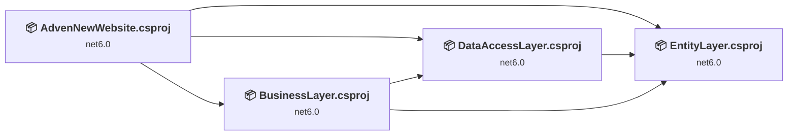
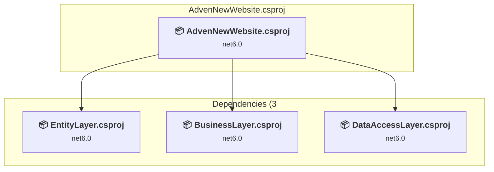
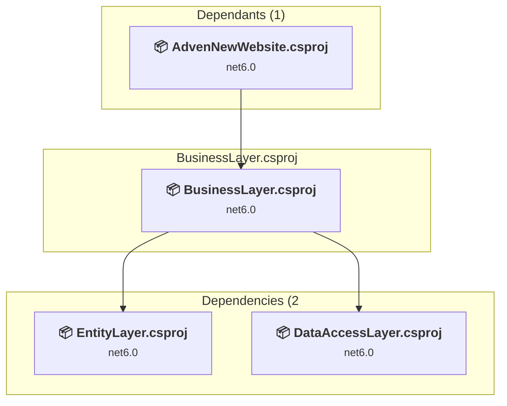
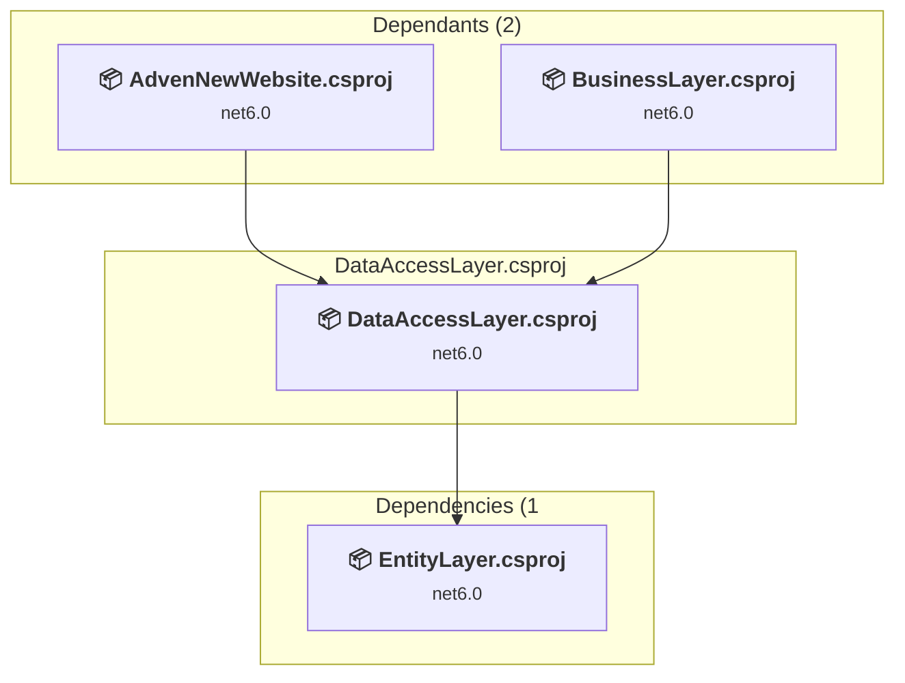
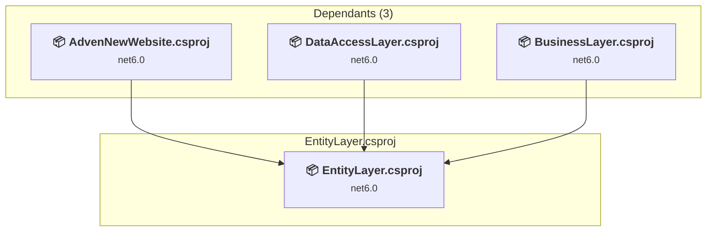

# Projects and dependencies analysis

This document provides a comprehensive overview of the projects and their dependencies in the context of upgrading to .NETCoreApp,Version=v10.0.

## Table of Contents

- [Executive Summary](#executive-Summary)
  - [Highlevel Metrics](#highlevel-metrics)
  - [Projects Compatibility](#projects-compatibility)
  - [Package Compatibility](#package-compatibility)
  - [API Compatibility](#api-compatibility)
  - [Binding Redirect Configuration](#binding-redirect-configuration)
- [Aggregate NuGet packages details](#aggregate-nuget-packages-details)
- [Top API Migration Challenges](#top-api-migration-challenges)
  - [Technologies and Features](#technologies-and-features)
  - [Most Frequent API Issues](#most-frequent-api-issues)
- [Projects Relationship Graph](#projects-relationship-graph)
- [Project Details](#project-details)

  - [AdvenNewWebsite\AdvenNewWebsite.csproj](#advennewwebsiteadvennewwebsitecsproj)
  - [BusinessLayer\BusinessLayer.csproj](#businesslayerbusinesslayercsproj)
  - [DataAccessLayer\DataAccessLayer.csproj](#dataaccesslayerdataaccesslayercsproj)
  - [EntityLayer\EntityLayer.csproj](#entitylayerentitylayercsproj)

## Executive Summary

### Highlevel Metrics

| Metric | Count | Status |
| :--- | :---: | :--- |
| Total Projects | 4 | All require upgrade |
| Total NuGet Packages | 210 | 5 need upgrade |
| Total Code Files | 176 |  |
| Total Code Files with Incidents | 5 |  |
| Total Lines of Code | 15895 |  |
| Total Number of Issues | 18 |  |
| Estimated LOC to modify | 1+ | at least 0,0% of codebase |

### Projects Compatibility

| Project | Target Framework | Difficulty | Package Issues | API Issues | Binding Issues | Est. LOC Impact | Description |
| :--- | :---: | :---: | :---: | :---: | :---: | :---: | :--- |
| [AdvenNewWebsite\AdvenNewWebsite.csproj](#advennewwebsiteadvennewwebsitecsproj) | net6.0 | 🟢 Low | 5 | 1 | 0 | 1+ | AspNetCore, Sdk Style = True |
| [BusinessLayer\BusinessLayer.csproj](#businesslayerbusinesslayercsproj) | net6.0 | 🟢 Low | 0 | 0 | 0 |  | ClassLibrary, Sdk Style = True |
| [DataAccessLayer\DataAccessLayer.csproj](#dataaccesslayerdataaccesslayercsproj) | net6.0 | 🟢 Low | 4 | 0 | 0 |  | ClassLibrary, Sdk Style = True |
| [EntityLayer\EntityLayer.csproj](#entitylayerentitylayercsproj) | net6.0 | 🟢 Low | 4 | 0 | 0 |  | ClassLibrary, Sdk Style = True |

### Package Compatibility

| Status | Count | Percentage |
| :--- | :---: | :---: |
| ✅ Compatible | 205 | 97,6% |
| ⚠️ Incompatible | 0 | 0,0% |
| 🔄 Upgrade Recommended | 5 | 2,4% |
| ***Total NuGet Packages*** | ***210*** | ***100%*** |

### API Compatibility

| Category | Count | Impact |
| :--- | :---: | :--- |
| 🔴 Binary Incompatible | 0 | High - Require code changes |
| 🟡 Source Incompatible | 0 | Medium - Needs re-compilation and potential conflicting API error fixing |
| 🔵 Behavioral change | 1 | Low - Behavioral changes that may require testing at runtime |
| ✅ Compatible | 29098 |  |
| ***Total APIs Analyzed*** | ***29099*** |  |

## Aggregate NuGet packages details

| Package | Current Version | Suggested Version | Projects | Description |
| :--- | :---: | :---: | :--- | :--- |
| Humanizer | 2.14.1 |  | [AdvenNewWebsite.csproj](#advennewwebsiteadvennewwebsitecsproj) | ✅Compatible |
| Humanizer.Core | 2.14.1 |  | [AdvenNewWebsite.csproj](#advennewwebsiteadvennewwebsitecsproj) | ✅Compatible |
| Humanizer.Core | 2.8.26 |  | [DataAccessLayer.csproj](#dataaccesslayerdataaccesslayercsproj) [EntityLayer.csproj](#entitylayerentitylayercsproj) | ✅Compatible |
| Humanizer.Core.af | 2.14.1 |  | [AdvenNewWebsite.csproj](#advennewwebsiteadvennewwebsitecsproj) | ✅Compatible |
| Humanizer.Core.ar | 2.14.1 |  | [AdvenNewWebsite.csproj](#advennewwebsiteadvennewwebsitecsproj) | ✅Compatible |
| Humanizer.Core.az | 2.14.1 |  | [AdvenNewWebsite.csproj](#advennewwebsiteadvennewwebsitecsproj) | ✅Compatible |
| Humanizer.Core.bg | 2.14.1 |  | [AdvenNewWebsite.csproj](#advennewwebsiteadvennewwebsitecsproj) | ✅Compatible |
| Humanizer.Core.bn-BD | 2.14.1 |  | [AdvenNewWebsite.csproj](#advennewwebsiteadvennewwebsitecsproj) | ✅Compatible |
| Humanizer.Core.cs | 2.14.1 |  | [AdvenNewWebsite.csproj](#advennewwebsiteadvennewwebsitecsproj) | ✅Compatible |
| Humanizer.Core.da | 2.14.1 |  | [AdvenNewWebsite.csproj](#advennewwebsiteadvennewwebsitecsproj) | ✅Compatible |
| Humanizer.Core.de | 2.14.1 |  | [AdvenNewWebsite.csproj](#advennewwebsiteadvennewwebsitecsproj) | ✅Compatible |
| Humanizer.Core.el | 2.14.1 |  | [AdvenNewWebsite.csproj](#advennewwebsiteadvennewwebsitecsproj) | ✅Compatible |
| Humanizer.Core.es | 2.14.1 |  | [AdvenNewWebsite.csproj](#advennewwebsiteadvennewwebsitecsproj) | ✅Compatible |
| Humanizer.Core.fa | 2.14.1 |  | [AdvenNewWebsite.csproj](#advennewwebsiteadvennewwebsitecsproj) | ✅Compatible |
| Humanizer.Core.fi-FI | 2.14.1 |  | [AdvenNewWebsite.csproj](#advennewwebsiteadvennewwebsitecsproj) | ✅Compatible |
| Humanizer.Core.fr | 2.14.1 |  | [AdvenNewWebsite.csproj](#advennewwebsiteadvennewwebsitecsproj) | ✅Compatible |
| Humanizer.Core.fr-BE | 2.14.1 |  | [AdvenNewWebsite.csproj](#advennewwebsiteadvennewwebsitecsproj) | ✅Compatible |
| Humanizer.Core.he | 2.14.1 |  | [AdvenNewWebsite.csproj](#advennewwebsiteadvennewwebsitecsproj) | ✅Compatible |
| Humanizer.Core.hr | 2.14.1 |  | [AdvenNewWebsite.csproj](#advennewwebsiteadvennewwebsitecsproj) | ✅Compatible |
| Humanizer.Core.hu | 2.14.1 |  | [AdvenNewWebsite.csproj](#advennewwebsiteadvennewwebsitecsproj) | ✅Compatible |
| Humanizer.Core.hy | 2.14.1 |  | [AdvenNewWebsite.csproj](#advennewwebsiteadvennewwebsitecsproj) | ✅Compatible |
| Humanizer.Core.id | 2.14.1 |  | [AdvenNewWebsite.csproj](#advennewwebsiteadvennewwebsitecsproj) | ✅Compatible |
| Humanizer.Core.is | 2.14.1 |  | [AdvenNewWebsite.csproj](#advennewwebsiteadvennewwebsitecsproj) | ✅Compatible |
| Humanizer.Core.it | 2.14.1 |  | [AdvenNewWebsite.csproj](#advennewwebsiteadvennewwebsitecsproj) | ✅Compatible |
| Humanizer.Core.ja | 2.14.1 |  | [AdvenNewWebsite.csproj](#advennewwebsiteadvennewwebsitecsproj) | ✅Compatible |
| Humanizer.Core.ko-KR | 2.14.1 |  | [AdvenNewWebsite.csproj](#advennewwebsiteadvennewwebsitecsproj) | ✅Compatible |
| Humanizer.Core.ku | 2.14.1 |  | [AdvenNewWebsite.csproj](#advennewwebsiteadvennewwebsitecsproj) | ✅Compatible |
| Humanizer.Core.lv | 2.14.1 |  | [AdvenNewWebsite.csproj](#advennewwebsiteadvennewwebsitecsproj) | ✅Compatible |
| Humanizer.Core.ms-MY | 2.14.1 |  | [AdvenNewWebsite.csproj](#advennewwebsiteadvennewwebsitecsproj) | ✅Compatible |
| Humanizer.Core.mt | 2.14.1 |  | [AdvenNewWebsite.csproj](#advennewwebsiteadvennewwebsitecsproj) | ✅Compatible |
| Humanizer.Core.nb | 2.14.1 |  | [AdvenNewWebsite.csproj](#advennewwebsiteadvennewwebsitecsproj) | ✅Compatible |
| Humanizer.Core.nb-NO | 2.14.1 |  | [AdvenNewWebsite.csproj](#advennewwebsiteadvennewwebsitecsproj) | ✅Compatible |
| Humanizer.Core.nl | 2.14.1 |  | [AdvenNewWebsite.csproj](#advennewwebsiteadvennewwebsitecsproj) | ✅Compatible |
| Humanizer.Core.pl | 2.14.1 |  | [AdvenNewWebsite.csproj](#advennewwebsiteadvennewwebsitecsproj) | ✅Compatible |
| Humanizer.Core.pt | 2.14.1 |  | [AdvenNewWebsite.csproj](#advennewwebsiteadvennewwebsitecsproj) | ✅Compatible |
| Humanizer.Core.ro | 2.14.1 |  | [AdvenNewWebsite.csproj](#advennewwebsiteadvennewwebsitecsproj) | ✅Compatible |
| Humanizer.Core.ru | 2.14.1 |  | [AdvenNewWebsite.csproj](#advennewwebsiteadvennewwebsitecsproj) | ✅Compatible |
| Humanizer.Core.sk | 2.14.1 |  | [AdvenNewWebsite.csproj](#advennewwebsiteadvennewwebsitecsproj) | ✅Compatible |
| Humanizer.Core.sl | 2.14.1 |  | [AdvenNewWebsite.csproj](#advennewwebsiteadvennewwebsitecsproj) | ✅Compatible |
| Humanizer.Core.sr | 2.14.1 |  | [AdvenNewWebsite.csproj](#advennewwebsiteadvennewwebsitecsproj) | ✅Compatible |
| Humanizer.Core.sr-Latn | 2.14.1 |  | [AdvenNewWebsite.csproj](#advennewwebsiteadvennewwebsitecsproj) | ✅Compatible |
| Humanizer.Core.sv | 2.14.1 |  | [AdvenNewWebsite.csproj](#advennewwebsiteadvennewwebsitecsproj) | ✅Compatible |
| Humanizer.Core.th-TH | 2.14.1 |  | [AdvenNewWebsite.csproj](#advennewwebsiteadvennewwebsitecsproj) | ✅Compatible |
| Humanizer.Core.tr | 2.14.1 |  | [AdvenNewWebsite.csproj](#advennewwebsiteadvennewwebsitecsproj) | ✅Compatible |
| Humanizer.Core.uk | 2.14.1 |  | [AdvenNewWebsite.csproj](#advennewwebsiteadvennewwebsitecsproj) | ✅Compatible |
| Humanizer.Core.uz-Cyrl-UZ | 2.14.1 |  | [AdvenNewWebsite.csproj](#advennewwebsiteadvennewwebsitecsproj) | ✅Compatible |
| Humanizer.Core.uz-Latn-UZ | 2.14.1 |  | [AdvenNewWebsite.csproj](#advennewwebsiteadvennewwebsitecsproj) | ✅Compatible |
| Humanizer.Core.vi | 2.14.1 |  | [AdvenNewWebsite.csproj](#advennewwebsiteadvennewwebsitecsproj) | ✅Compatible |
| Humanizer.Core.zh-CN | 2.14.1 |  | [AdvenNewWebsite.csproj](#advennewwebsiteadvennewwebsitecsproj) | ✅Compatible |
| Humanizer.Core.zh-Hans | 2.14.1 |  | [AdvenNewWebsite.csproj](#advennewwebsiteadvennewwebsitecsproj) | ✅Compatible |
| Humanizer.Core.zh-Hant | 2.14.1 |  | [AdvenNewWebsite.csproj](#advennewwebsiteadvennewwebsitecsproj) | ✅Compatible |
| MessagePack | 2.1.152 |  | [AdvenNewWebsite.csproj](#advennewwebsiteadvennewwebsitecsproj) | ✅Compatible |
| MessagePack.Annotations | 2.1.152 |  | [AdvenNewWebsite.csproj](#advennewwebsiteadvennewwebsitecsproj) | ✅Compatible |
| MessagePackAnalyzer | 2.1.152 |  | [AdvenNewWebsite.csproj](#advennewwebsiteadvennewwebsitecsproj) | ✅Compatible |
| Microsoft.AspNetCore.Razor.Language | 6.0.0 |  | [AdvenNewWebsite.csproj](#advennewwebsiteadvennewwebsitecsproj) | ✅Compatible |
| Microsoft.Bcl.AsyncInterfaces | 5.0.0 |  | [AdvenNewWebsite.csproj](#advennewwebsiteadvennewwebsitecsproj) | ✅Compatible |
| Microsoft.CodeAnalysis.Analyzers | 3.3.2 |  | [AdvenNewWebsite.csproj](#advennewwebsiteadvennewwebsitecsproj) | ✅Compatible |
| Microsoft.CodeAnalysis.AnalyzerUtilities | 3.3.0 |  | [AdvenNewWebsite.csproj](#advennewwebsiteadvennewwebsitecsproj) | ✅Compatible |
| Microsoft.CodeAnalysis.Common | 4.0.0 |  | [AdvenNewWebsite.csproj](#advennewwebsiteadvennewwebsitecsproj) | ✅Compatible |
| Microsoft.CodeAnalysis.CSharp | 4.0.0 |  | [AdvenNewWebsite.csproj](#advennewwebsiteadvennewwebsitecsproj) | ✅Compatible |
| Microsoft.CodeAnalysis.CSharp.Features | 4.0.0 |  | [AdvenNewWebsite.csproj](#advennewwebsiteadvennewwebsitecsproj) | ✅Compatible |
| Microsoft.CodeAnalysis.CSharp.Workspaces | 4.0.0 |  | [AdvenNewWebsite.csproj](#advennewwebsiteadvennewwebsitecsproj) | ✅Compatible |
| Microsoft.CodeAnalysis.Features | 4.0.0 |  | [AdvenNewWebsite.csproj](#advennewwebsiteadvennewwebsitecsproj) | ✅Compatible |
| Microsoft.CodeAnalysis.Razor | 6.0.0 |  | [AdvenNewWebsite.csproj](#advennewwebsiteadvennewwebsitecsproj) | ✅Compatible |
| Microsoft.CodeAnalysis.Scripting.Common | 4.0.0 |  | [AdvenNewWebsite.csproj](#advennewwebsiteadvennewwebsitecsproj) | ✅Compatible |
| Microsoft.CodeAnalysis.Workspaces.Common | 4.0.0 |  | [AdvenNewWebsite.csproj](#advennewwebsiteadvennewwebsitecsproj) | ✅Compatible |
| Microsoft.CSharp | 4.5.0 |  | [AdvenNewWebsite.csproj](#advennewwebsiteadvennewwebsitecsproj) [BusinessLayer.csproj](#businesslayerbusinesslayercsproj) [DataAccessLayer.csproj](#dataaccesslayerdataaccesslayercsproj) [EntityLayer.csproj](#entitylayerentitylayercsproj) | ✅Compatible |
| Microsoft.Data.SqlClient | 2.1.7 |  | [AdvenNewWebsite.csproj](#advennewwebsiteadvennewwebsitecsproj) [BusinessLayer.csproj](#businesslayerbusinesslayercsproj) [DataAccessLayer.csproj](#dataaccesslayerdataaccesslayercsproj) [EntityLayer.csproj](#entitylayerentitylayercsproj) | ✅Compatible |
| Microsoft.Data.SqlClient.SNI.runtime | 2.1.1 |  | [AdvenNewWebsite.csproj](#advennewwebsiteadvennewwebsitecsproj) [BusinessLayer.csproj](#businesslayerbusinesslayercsproj) [DataAccessLayer.csproj](#dataaccesslayerdataaccesslayercsproj) [EntityLayer.csproj](#entitylayerentitylayercsproj) | ✅Compatible |
| Microsoft.DiaSymReader | 1.3.0 |  | [AdvenNewWebsite.csproj](#advennewwebsiteadvennewwebsitecsproj) | ✅Compatible |
| Microsoft.DotNet.Scaffolding.Shared | 6.0.18 |  | [AdvenNewWebsite.csproj](#advennewwebsiteadvennewwebsitecsproj) | ✅Compatible |
| Microsoft.EntityFrameworkCore | 6.0.36 | 10.0.12 | [AdvenNewWebsite.csproj](#advennewwebsiteadvennewwebsitecsproj) [BusinessLayer.csproj](#businesslayerbusinesslayercsproj) [DataAccessLayer.csproj](#dataaccesslayerdataaccesslayercsproj) [EntityLayer.csproj](#entitylayerentitylayercsproj) | NuGet package upgrade is recommended |
| Microsoft.EntityFrameworkCore.Abstractions | 6.0.36 |  | [AdvenNewWebsite.csproj](#advennewwebsiteadvennewwebsitecsproj) [BusinessLayer.csproj](#businesslayerbusinesslayercsproj) [DataAccessLayer.csproj](#dataaccesslayerdataaccesslayercsproj) [EntityLayer.csproj](#entitylayerentitylayercsproj) | ✅Compatible |
| Microsoft.EntityFrameworkCore.Analyzers | 6.0.36 |  | [AdvenNewWebsite.csproj](#advennewwebsiteadvennewwebsitecsproj) [BusinessLayer.csproj](#businesslayerbusinesslayercsproj) [DataAccessLayer.csproj](#dataaccesslayerdataaccesslayercsproj) [EntityLayer.csproj](#entitylayerentitylayercsproj) | ✅Compatible |
| Microsoft.EntityFrameworkCore.Design | 6.0.36 | 10.0.12 | [AdvenNewWebsite.csproj](#advennewwebsiteadvennewwebsitecsproj) [DataAccessLayer.csproj](#dataaccesslayerdataaccesslayercsproj) [EntityLayer.csproj](#entitylayerentitylayercsproj) | NuGet package upgrade is recommended |
| Microsoft.EntityFrameworkCore.Relational | 6.0.36 |  | [AdvenNewWebsite.csproj](#advennewwebsiteadvennewwebsitecsproj) [BusinessLayer.csproj](#businesslayerbusinesslayercsproj) [DataAccessLayer.csproj](#dataaccesslayerdataaccesslayercsproj) [EntityLayer.csproj](#entitylayerentitylayercsproj) | ✅Compatible |
| Microsoft.EntityFrameworkCore.SqlServer | 6.0.36 | 10.0.12 | [AdvenNewWebsite.csproj](#advennewwebsiteadvennewwebsitecsproj) [BusinessLayer.csproj](#businesslayerbusinesslayercsproj) [DataAccessLayer.csproj](#dataaccesslayerdataaccesslayercsproj) [EntityLayer.csproj](#entitylayerentitylayercsproj) | NuGet package upgrade is recommended |
| Microsoft.EntityFrameworkCore.Tools | 6.0.36 | 10.0.12 | [AdvenNewWebsite.csproj](#advennewwebsiteadvennewwebsitecsproj) [DataAccessLayer.csproj](#dataaccesslayerdataaccesslayercsproj) [EntityLayer.csproj](#entitylayerentitylayercsproj) | NuGet package upgrade is recommended |
| Microsoft.Extensions.Caching.Abstractions | 6.0.1 |  | [AdvenNewWebsite.csproj](#advennewwebsiteadvennewwebsitecsproj) [BusinessLayer.csproj](#businesslayerbusinesslayercsproj) [DataAccessLayer.csproj](#dataaccesslayerdataaccesslayercsproj) [EntityLayer.csproj](#entitylayerentitylayercsproj) | ✅Compatible |
| Microsoft.Extensions.Caching.Memory | 6.0.3 |  | [AdvenNewWebsite.csproj](#advennewwebsiteadvennewwebsitecsproj) [BusinessLayer.csproj](#businesslayerbusinesslayercsproj) [DataAccessLayer.csproj](#dataaccesslayerdataaccesslayercsproj) [EntityLayer.csproj](#entitylayerentitylayercsproj) | ✅Compatible |
| Microsoft.Extensions.Configuration.Abstractions | 6.0.1 |  | [AdvenNewWebsite.csproj](#advennewwebsiteadvennewwebsitecsproj) [BusinessLayer.csproj](#businesslayerbusinesslayercsproj) [DataAccessLayer.csproj](#dataaccesslayerdataaccesslayercsproj) [EntityLayer.csproj](#entitylayerentitylayercsproj) | ✅Compatible |
| Microsoft.Extensions.DependencyInjection | 6.0.2 |  | [AdvenNewWebsite.csproj](#advennewwebsiteadvennewwebsitecsproj) [BusinessLayer.csproj](#businesslayerbusinesslayercsproj) [DataAccessLayer.csproj](#dataaccesslayerdataaccesslayercsproj) [EntityLayer.csproj](#entitylayerentitylayercsproj) | ✅Compatible |
| Microsoft.Extensions.DependencyInjection.Abstractions | 6.0.0 |  | [AdvenNewWebsite.csproj](#advennewwebsiteadvennewwebsitecsproj) [BusinessLayer.csproj](#businesslayerbusinesslayercsproj) [DataAccessLayer.csproj](#dataaccesslayerdataaccesslayercsproj) [EntityLayer.csproj](#entitylayerentitylayercsproj) | ✅Compatible |
| Microsoft.Extensions.Logging | 6.0.1 |  | [AdvenNewWebsite.csproj](#advennewwebsiteadvennewwebsitecsproj) [BusinessLayer.csproj](#businesslayerbusinesslayercsproj) [DataAccessLayer.csproj](#dataaccesslayerdataaccesslayercsproj) [EntityLayer.csproj](#entitylayerentitylayercsproj) | ✅Compatible |
| Microsoft.Extensions.Logging.Abstractions | 6.0.4 |  | [AdvenNewWebsite.csproj](#advennewwebsiteadvennewwebsitecsproj) [BusinessLayer.csproj](#businesslayerbusinesslayercsproj) [DataAccessLayer.csproj](#dataaccesslayerdataaccesslayercsproj) [EntityLayer.csproj](#entitylayerentitylayercsproj) | ✅Compatible |
| Microsoft.Extensions.Options | 6.0.1 |  | [AdvenNewWebsite.csproj](#advennewwebsiteadvennewwebsitecsproj) [BusinessLayer.csproj](#businesslayerbusinesslayercsproj) [DataAccessLayer.csproj](#dataaccesslayerdataaccesslayercsproj) [EntityLayer.csproj](#entitylayerentitylayercsproj) | ✅Compatible |
| Microsoft.Extensions.Primitives | 6.0.1 |  | [AdvenNewWebsite.csproj](#advennewwebsiteadvennewwebsitecsproj) [BusinessLayer.csproj](#businesslayerbusinesslayercsproj) [DataAccessLayer.csproj](#dataaccesslayerdataaccesslayercsproj) [EntityLayer.csproj](#entitylayerentitylayercsproj) | ✅Compatible |
| Microsoft.Identity.Client | 4.21.1 |  | [AdvenNewWebsite.csproj](#advennewwebsiteadvennewwebsitecsproj) [BusinessLayer.csproj](#businesslayerbusinesslayercsproj) [DataAccessLayer.csproj](#dataaccesslayerdataaccesslayercsproj) [EntityLayer.csproj](#entitylayerentitylayercsproj) | ✅Compatible |
| Microsoft.IdentityModel.Abstractions | 6.36.0 |  | [AdvenNewWebsite.csproj](#advennewwebsiteadvennewwebsitecsproj) [BusinessLayer.csproj](#businesslayerbusinesslayercsproj) [DataAccessLayer.csproj](#dataaccesslayerdataaccesslayercsproj) [EntityLayer.csproj](#entitylayerentitylayercsproj) | ✅Compatible |
| Microsoft.IdentityModel.JsonWebTokens | 6.36.0 |  | [AdvenNewWebsite.csproj](#advennewwebsiteadvennewwebsitecsproj) [BusinessLayer.csproj](#businesslayerbusinesslayercsproj) [DataAccessLayer.csproj](#dataaccesslayerdataaccesslayercsproj) [EntityLayer.csproj](#entitylayerentitylayercsproj) | ✅Compatible |
| Microsoft.IdentityModel.Logging | 6.36.0 |  | [AdvenNewWebsite.csproj](#advennewwebsiteadvennewwebsitecsproj) [BusinessLayer.csproj](#businesslayerbusinesslayercsproj) [DataAccessLayer.csproj](#dataaccesslayerdataaccesslayercsproj) [EntityLayer.csproj](#entitylayerentitylayercsproj) | ✅Compatible |
| Microsoft.IdentityModel.Protocols | 6.36.0 |  | [AdvenNewWebsite.csproj](#advennewwebsiteadvennewwebsitecsproj) [BusinessLayer.csproj](#businesslayerbusinesslayercsproj) [DataAccessLayer.csproj](#dataaccesslayerdataaccesslayercsproj) [EntityLayer.csproj](#entitylayerentitylayercsproj) | ✅Compatible |
| Microsoft.IdentityModel.Protocols.OpenIdConnect | 6.36.0 |  | [AdvenNewWebsite.csproj](#advennewwebsiteadvennewwebsitecsproj) [BusinessLayer.csproj](#businesslayerbusinesslayercsproj) [DataAccessLayer.csproj](#dataaccesslayerdataaccesslayercsproj) [EntityLayer.csproj](#entitylayerentitylayercsproj) | ✅Compatible |
| Microsoft.IdentityModel.Tokens | 6.36.0 |  | [AdvenNewWebsite.csproj](#advennewwebsiteadvennewwebsitecsproj) [BusinessLayer.csproj](#businesslayerbusinesslayercsproj) [DataAccessLayer.csproj](#dataaccesslayerdataaccesslayercsproj) [EntityLayer.csproj](#entitylayerentitylayercsproj) | ✅Compatible |
| Microsoft.NETCore.Platforms | 3.1.9 |  | [AdvenNewWebsite.csproj](#advennewwebsiteadvennewwebsitecsproj) [BusinessLayer.csproj](#businesslayerbusinesslayercsproj) [DataAccessLayer.csproj](#dataaccesslayerdataaccesslayercsproj) [EntityLayer.csproj](#entitylayerentitylayercsproj) | ✅Compatible |
| Microsoft.NETCore.Targets | 1.1.0 |  | [AdvenNewWebsite.csproj](#advennewwebsiteadvennewwebsitecsproj) | ✅Compatible |
| Microsoft.VisualStudio.Debugger.Contracts | 17.2.0 |  | [AdvenNewWebsite.csproj](#advennewwebsiteadvennewwebsitecsproj) | ✅Compatible |
| Microsoft.VisualStudio.Web.CodeGeneration | 6.0.18 |  | [AdvenNewWebsite.csproj](#advennewwebsiteadvennewwebsitecsproj) | ✅Compatible |
| Microsoft.VisualStudio.Web.CodeGeneration.Core | 6.0.18 |  | [AdvenNewWebsite.csproj](#advennewwebsiteadvennewwebsitecsproj) | ✅Compatible |
| Microsoft.VisualStudio.Web.CodeGeneration.Design | 6.0.18 | 10.0.2 | [AdvenNewWebsite.csproj](#advennewwebsiteadvennewwebsitecsproj) | NuGet package upgrade is recommended |
| Microsoft.VisualStudio.Web.CodeGeneration.EntityFrameworkCore | 6.0.18 |  | [AdvenNewWebsite.csproj](#advennewwebsiteadvennewwebsitecsproj) | ✅Compatible |
| Microsoft.VisualStudio.Web.CodeGeneration.Templating | 6.0.18 |  | [AdvenNewWebsite.csproj](#advennewwebsiteadvennewwebsitecsproj) | ✅Compatible |
| Microsoft.VisualStudio.Web.CodeGeneration.Utils | 6.0.18 |  | [AdvenNewWebsite.csproj](#advennewwebsiteadvennewwebsitecsproj) | ✅Compatible |
| Microsoft.VisualStudio.Web.CodeGenerators.Mvc | 6.0.18 |  | [AdvenNewWebsite.csproj](#advennewwebsiteadvennewwebsitecsproj) | ✅Compatible |
| Microsoft.Win32.Primitives | 4.3.0 |  | [AdvenNewWebsite.csproj](#advennewwebsiteadvennewwebsitecsproj) | ✅Compatible |
| Microsoft.Win32.Registry | 4.7.0 |  | [AdvenNewWebsite.csproj](#advennewwebsiteadvennewwebsitecsproj) [BusinessLayer.csproj](#businesslayerbusinesslayercsproj) [DataAccessLayer.csproj](#dataaccesslayerdataaccesslayercsproj) [EntityLayer.csproj](#entitylayerentitylayercsproj) | ✅Compatible |
| Microsoft.Win32.SystemEvents | 4.7.0 |  | [AdvenNewWebsite.csproj](#advennewwebsiteadvennewwebsitecsproj) [BusinessLayer.csproj](#businesslayerbusinesslayercsproj) [DataAccessLayer.csproj](#dataaccesslayerdataaccesslayercsproj) [EntityLayer.csproj](#entitylayerentitylayercsproj) | ✅Compatible |
| NETStandard.Library | 1.6.1 |  | [AdvenNewWebsite.csproj](#advennewwebsiteadvennewwebsitecsproj) | ✅Compatible |
| Newtonsoft.Json | 13.0.3 |  | [AdvenNewWebsite.csproj](#advennewwebsiteadvennewwebsitecsproj) | ✅Compatible |
| NuGet.Common | 6.9.1 |  | [AdvenNewWebsite.csproj](#advennewwebsiteadvennewwebsitecsproj) | ✅Compatible |
| NuGet.Configuration | 6.9.1 |  | [AdvenNewWebsite.csproj](#advennewwebsiteadvennewwebsitecsproj) | ✅Compatible |
| NuGet.DependencyResolver.Core | 6.9.1 |  | [AdvenNewWebsite.csproj](#advennewwebsiteadvennewwebsitecsproj) | ✅Compatible |
| NuGet.Frameworks | 6.9.1 |  | [AdvenNewWebsite.csproj](#advennewwebsiteadvennewwebsitecsproj) | ✅Compatible |
| NuGet.LibraryModel | 6.9.1 |  | [AdvenNewWebsite.csproj](#advennewwebsiteadvennewwebsitecsproj) | ✅Compatible |
| NuGet.Packaging | 6.9.1 |  | [AdvenNewWebsite.csproj](#advennewwebsiteadvennewwebsitecsproj) | ✅Compatible |
| NuGet.ProjectModel | 6.9.1 |  | [AdvenNewWebsite.csproj](#advennewwebsiteadvennewwebsitecsproj) | ✅Compatible |
| NuGet.Protocol | 6.9.1 |  | [AdvenNewWebsite.csproj](#advennewwebsiteadvennewwebsitecsproj) | ✅Compatible |
| NuGet.Versioning | 6.9.1 |  | [AdvenNewWebsite.csproj](#advennewwebsiteadvennewwebsitecsproj) | ✅Compatible |
| runtime.debian.8-x64.runtime.native.System.Security.Cryptography.OpenSsl | 4.3.0 |  | [AdvenNewWebsite.csproj](#advennewwebsiteadvennewwebsitecsproj) | ✅Compatible |
| runtime.fedora.23-x64.runtime.native.System.Security.Cryptography.OpenSsl | 4.3.0 |  | [AdvenNewWebsite.csproj](#advennewwebsiteadvennewwebsitecsproj) | ✅Compatible |
| runtime.fedora.24-x64.runtime.native.System.Security.Cryptography.OpenSsl | 4.3.0 |  | [AdvenNewWebsite.csproj](#advennewwebsiteadvennewwebsitecsproj) | ✅Compatible |
| runtime.native.System | 4.3.0 |  | [AdvenNewWebsite.csproj](#advennewwebsiteadvennewwebsitecsproj) | ✅Compatible |
| runtime.native.System.IO.Compression | 4.3.0 |  | [AdvenNewWebsite.csproj](#advennewwebsiteadvennewwebsitecsproj) | ✅Compatible |
| runtime.native.System.Net.Http | 4.3.0 |  | [AdvenNewWebsite.csproj](#advennewwebsiteadvennewwebsitecsproj) | ✅Compatible |
| runtime.native.System.Security.Cryptography.Apple | 4.3.0 |  | [AdvenNewWebsite.csproj](#advennewwebsiteadvennewwebsitecsproj) | ✅Compatible |
| runtime.native.System.Security.Cryptography.OpenSsl | 4.3.0 |  | [AdvenNewWebsite.csproj](#advennewwebsiteadvennewwebsitecsproj) | ✅Compatible |
| runtime.opensuse.13.2-x64.runtime.native.System.Security.Cryptography.OpenSsl | 4.3.0 |  | [AdvenNewWebsite.csproj](#advennewwebsiteadvennewwebsitecsproj) | ✅Compatible |
| runtime.opensuse.42.1-x64.runtime.native.System.Security.Cryptography.OpenSsl | 4.3.0 |  | [AdvenNewWebsite.csproj](#advennewwebsiteadvennewwebsitecsproj) | ✅Compatible |
| runtime.osx.10.10-x64.runtime.native.System.Security.Cryptography.Apple | 4.3.0 |  | [AdvenNewWebsite.csproj](#advennewwebsiteadvennewwebsitecsproj) | ✅Compatible |
| runtime.osx.10.10-x64.runtime.native.System.Security.Cryptography.OpenSsl | 4.3.0 |  | [AdvenNewWebsite.csproj](#advennewwebsiteadvennewwebsitecsproj) | ✅Compatible |
| runtime.rhel.7-x64.runtime.native.System.Security.Cryptography.OpenSsl | 4.3.0 |  | [AdvenNewWebsite.csproj](#advennewwebsiteadvennewwebsitecsproj) | ✅Compatible |
| runtime.ubuntu.14.04-x64.runtime.native.System.Security.Cryptography.OpenSsl | 4.3.0 |  | [AdvenNewWebsite.csproj](#advennewwebsiteadvennewwebsitecsproj) | ✅Compatible |
| runtime.ubuntu.16.04-x64.runtime.native.System.Security.Cryptography.OpenSsl | 4.3.0 |  | [AdvenNewWebsite.csproj](#advennewwebsiteadvennewwebsitecsproj) | ✅Compatible |
| runtime.ubuntu.16.10-x64.runtime.native.System.Security.Cryptography.OpenSsl | 4.3.0 |  | [AdvenNewWebsite.csproj](#advennewwebsiteadvennewwebsitecsproj) | ✅Compatible |
| System.AppContext | 4.3.0 |  | [AdvenNewWebsite.csproj](#advennewwebsiteadvennewwebsitecsproj) | ✅Compatible |
| System.Buffers | 4.3.0 |  | [AdvenNewWebsite.csproj](#advennewwebsiteadvennewwebsitecsproj) | ✅Compatible |
| System.Collections | 4.3.0 |  | [AdvenNewWebsite.csproj](#advennewwebsiteadvennewwebsitecsproj) | ✅Compatible |
| System.Collections.Concurrent | 4.3.0 |  | [AdvenNewWebsite.csproj](#advennewwebsiteadvennewwebsitecsproj) | ✅Compatible |
| System.Collections.Immutable | 6.0.1 |  | [AdvenNewWebsite.csproj](#advennewwebsiteadvennewwebsitecsproj) [BusinessLayer.csproj](#businesslayerbusinesslayercsproj) [DataAccessLayer.csproj](#dataaccesslayerdataaccesslayercsproj) [EntityLayer.csproj](#entitylayerentitylayercsproj) | ✅Compatible |
| System.Composition | 1.0.31 |  | [AdvenNewWebsite.csproj](#advennewwebsiteadvennewwebsitecsproj) | ✅Compatible |
| System.Composition.AttributedModel | 1.0.31 |  | [AdvenNewWebsite.csproj](#advennewwebsiteadvennewwebsitecsproj) | ✅Compatible |
| System.Composition.Convention | 1.0.31 |  | [AdvenNewWebsite.csproj](#advennewwebsiteadvennewwebsitecsproj) | ✅Compatible |
| System.Composition.Hosting | 1.0.31 |  | [AdvenNewWebsite.csproj](#advennewwebsiteadvennewwebsitecsproj) | ✅Compatible |
| System.Composition.Runtime | 1.0.31 |  | [AdvenNewWebsite.csproj](#advennewwebsiteadvennewwebsitecsproj) | ✅Compatible |
| System.Composition.TypedParts | 1.0.31 |  | [AdvenNewWebsite.csproj](#advennewwebsiteadvennewwebsitecsproj) | ✅Compatible |
| System.Configuration.ConfigurationManager | 4.7.0 |  | [AdvenNewWebsite.csproj](#advennewwebsiteadvennewwebsitecsproj) [BusinessLayer.csproj](#businesslayerbusinesslayercsproj) [DataAccessLayer.csproj](#dataaccesslayerdataaccesslayercsproj) [EntityLayer.csproj](#entitylayerentitylayercsproj) | ✅Compatible |
| System.Console | 4.3.0 |  | [AdvenNewWebsite.csproj](#advennewwebsiteadvennewwebsitecsproj) | ✅Compatible |
| System.Diagnostics.Debug | 4.3.0 |  | [AdvenNewWebsite.csproj](#advennewwebsiteadvennewwebsitecsproj) | ✅Compatible |
| System.Diagnostics.DiagnosticSource | 6.0.2 |  | [AdvenNewWebsite.csproj](#advennewwebsiteadvennewwebsitecsproj) [BusinessLayer.csproj](#businesslayerbusinesslayercsproj) [DataAccessLayer.csproj](#dataaccesslayerdataaccesslayercsproj) [EntityLayer.csproj](#entitylayerentitylayercsproj) | ✅Compatible |
| System.Diagnostics.Tools | 4.3.0 |  | [AdvenNewWebsite.csproj](#advennewwebsiteadvennewwebsitecsproj) | ✅Compatible |
| System.Diagnostics.Tracing | 4.3.0 |  | [AdvenNewWebsite.csproj](#advennewwebsiteadvennewwebsitecsproj) | ✅Compatible |
| System.Drawing.Common | 4.7.3 |  | [AdvenNewWebsite.csproj](#advennewwebsiteadvennewwebsitecsproj) [BusinessLayer.csproj](#businesslayerbusinesslayercsproj) [DataAccessLayer.csproj](#dataaccesslayerdataaccesslayercsproj) [EntityLayer.csproj](#entitylayerentitylayercsproj) | ✅Compatible |
| System.Formats.Asn1 | 6.0.1 |  | [AdvenNewWebsite.csproj](#advennewwebsiteadvennewwebsitecsproj) | ✅Compatible |
| System.Globalization | 4.3.0 |  | [AdvenNewWebsite.csproj](#advennewwebsiteadvennewwebsitecsproj) | ✅Compatible |
| System.Globalization.Calendars | 4.3.0 |  | [AdvenNewWebsite.csproj](#advennewwebsiteadvennewwebsitecsproj) | ✅Compatible |
| System.Globalization.Extensions | 4.3.0 |  | [AdvenNewWebsite.csproj](#advennewwebsiteadvennewwebsitecsproj) | ✅Compatible |
| System.IdentityModel.Tokens.Jwt | 6.36.0 |  | [AdvenNewWebsite.csproj](#advennewwebsiteadvennewwebsitecsproj) [BusinessLayer.csproj](#businesslayerbusinesslayercsproj) [DataAccessLayer.csproj](#dataaccesslayerdataaccesslayercsproj) [EntityLayer.csproj](#entitylayerentitylayercsproj) | ✅Compatible |
| System.IO | 4.3.0 |  | [AdvenNewWebsite.csproj](#advennewwebsiteadvennewwebsitecsproj) | ✅Compatible |
| System.IO.Compression | 4.3.0 |  | [AdvenNewWebsite.csproj](#advennewwebsiteadvennewwebsitecsproj) | ✅Compatible |
| System.IO.Compression.ZipFile | 4.3.0 |  | [AdvenNewWebsite.csproj](#advennewwebsiteadvennewwebsitecsproj) | ✅Compatible |
| System.IO.FileSystem | 4.3.0 |  | [AdvenNewWebsite.csproj](#advennewwebsiteadvennewwebsitecsproj) | ✅Compatible |
| System.IO.FileSystem.Primitives | 4.3.0 |  | [AdvenNewWebsite.csproj](#advennewwebsiteadvennewwebsitecsproj) | ✅Compatible |
| System.IO.Pipelines | 5.0.1 |  | [AdvenNewWebsite.csproj](#advennewwebsiteadvennewwebsitecsproj) | ✅Compatible |
| System.Linq | 4.3.0 |  | [AdvenNewWebsite.csproj](#advennewwebsiteadvennewwebsitecsproj) | ✅Compatible |
| System.Linq.Expressions | 4.3.0 |  | [AdvenNewWebsite.csproj](#advennewwebsiteadvennewwebsitecsproj) | ✅Compatible |
| System.Memory | 4.5.4 |  | [AdvenNewWebsite.csproj](#advennewwebsiteadvennewwebsitecsproj) | ✅Compatible |
| System.Net.Http | 4.3.0 |  | [AdvenNewWebsite.csproj](#advennewwebsiteadvennewwebsitecsproj) | ✅Compatible |
| System.Net.Primitives | 4.3.0 |  | [AdvenNewWebsite.csproj](#advennewwebsiteadvennewwebsitecsproj) | ✅Compatible |
| System.Net.Sockets | 4.3.0 |  | [AdvenNewWebsite.csproj](#advennewwebsiteadvennewwebsitecsproj) | ✅Compatible |
| System.ObjectModel | 4.3.0 |  | [AdvenNewWebsite.csproj](#advennewwebsiteadvennewwebsitecsproj) | ✅Compatible |
| System.Reflection | 4.3.0 |  | [AdvenNewWebsite.csproj](#advennewwebsiteadvennewwebsitecsproj) | ✅Compatible |
| System.Reflection.Emit | 4.6.0 |  | [AdvenNewWebsite.csproj](#advennewwebsiteadvennewwebsitecsproj) | ✅Compatible |
| System.Reflection.Emit.ILGeneration | 4.3.0 |  | [AdvenNewWebsite.csproj](#advennewwebsiteadvennewwebsitecsproj) | ✅Compatible |
| System.Reflection.Emit.Lightweight | 4.6.0 |  | [AdvenNewWebsite.csproj](#advennewwebsiteadvennewwebsitecsproj) | ✅Compatible |
| System.Reflection.Extensions | 4.3.0 |  | [AdvenNewWebsite.csproj](#advennewwebsiteadvennewwebsitecsproj) | ✅Compatible |
| System.Reflection.Metadata | 5.0.0 |  | [AdvenNewWebsite.csproj](#advennewwebsiteadvennewwebsitecsproj) | ✅Compatible |
| System.Reflection.Primitives | 4.3.0 |  | [AdvenNewWebsite.csproj](#advennewwebsiteadvennewwebsitecsproj) | ✅Compatible |
| System.Reflection.TypeExtensions | 4.3.0 |  | [AdvenNewWebsite.csproj](#advennewwebsiteadvennewwebsitecsproj) | ✅Compatible |
| System.Resources.ResourceManager | 4.3.0 |  | [AdvenNewWebsite.csproj](#advennewwebsiteadvennewwebsitecsproj) | ✅Compatible |
| System.Runtime | 4.3.0 |  | [AdvenNewWebsite.csproj](#advennewwebsiteadvennewwebsitecsproj) | ✅Compatible |
| System.Runtime.Caching | 4.7.0 |  | [AdvenNewWebsite.csproj](#advennewwebsiteadvennewwebsitecsproj) [BusinessLayer.csproj](#businesslayerbusinesslayercsproj) [DataAccessLayer.csproj](#dataaccesslayerdataaccesslayercsproj) [EntityLayer.csproj](#entitylayerentitylayercsproj) | ✅Compatible |
| System.Runtime.CompilerServices.Unsafe | 5.0.0 |  | [AdvenNewWebsite.csproj](#advennewwebsiteadvennewwebsitecsproj) | ✅Compatible |
| System.Runtime.Extensions | 4.3.0 |  | [AdvenNewWebsite.csproj](#advennewwebsiteadvennewwebsitecsproj) | ✅Compatible |
| System.Runtime.Handles | 4.3.0 |  | [AdvenNewWebsite.csproj](#advennewwebsiteadvennewwebsitecsproj) | ✅Compatible |
| System.Runtime.InteropServices | 4.3.0 |  | [AdvenNewWebsite.csproj](#advennewwebsiteadvennewwebsitecsproj) | ✅Compatible |
| System.Runtime.InteropServices.RuntimeInformation | 4.3.0 |  | [AdvenNewWebsite.csproj](#advennewwebsiteadvennewwebsitecsproj) | ✅Compatible |
| System.Runtime.Numerics | 4.3.0 |  | [AdvenNewWebsite.csproj](#advennewwebsiteadvennewwebsitecsproj) | ✅Compatible |
| System.Security.AccessControl | 4.7.0 |  | [AdvenNewWebsite.csproj](#advennewwebsiteadvennewwebsitecsproj) [BusinessLayer.csproj](#businesslayerbusinesslayercsproj) [DataAccessLayer.csproj](#dataaccesslayerdataaccesslayercsproj) [EntityLayer.csproj](#entitylayerentitylayercsproj) | ✅Compatible |
| System.Security.Cryptography.Algorithms | 4.3.0 |  | [AdvenNewWebsite.csproj](#advennewwebsiteadvennewwebsitecsproj) | ✅Compatible |
| System.Security.Cryptography.Cng | 4.5.0 |  | [AdvenNewWebsite.csproj](#advennewwebsiteadvennewwebsitecsproj) [BusinessLayer.csproj](#businesslayerbusinesslayercsproj) [DataAccessLayer.csproj](#dataaccesslayerdataaccesslayercsproj) [EntityLayer.csproj](#entitylayerentitylayercsproj) | ✅Compatible |
| System.Security.Cryptography.Csp | 4.3.0 |  | [AdvenNewWebsite.csproj](#advennewwebsiteadvennewwebsitecsproj) | ✅Compatible |
| System.Security.Cryptography.Encoding | 4.3.0 |  | [AdvenNewWebsite.csproj](#advennewwebsiteadvennewwebsitecsproj) | ✅Compatible |
| System.Security.Cryptography.OpenSsl | 4.3.0 |  | [AdvenNewWebsite.csproj](#advennewwebsiteadvennewwebsitecsproj) | ✅Compatible |
| System.Security.Cryptography.Pkcs | 6.0.4 |  | [AdvenNewWebsite.csproj](#advennewwebsiteadvennewwebsitecsproj) | ✅Compatible |
| System.Security.Cryptography.Primitives | 4.3.0 |  | [AdvenNewWebsite.csproj](#advennewwebsiteadvennewwebsitecsproj) | ✅Compatible |
| System.Security.Cryptography.ProtectedData | 4.7.0 |  | [AdvenNewWebsite.csproj](#advennewwebsiteadvennewwebsitecsproj) [BusinessLayer.csproj](#businesslayerbusinesslayercsproj) [DataAccessLayer.csproj](#dataaccesslayerdataaccesslayercsproj) [EntityLayer.csproj](#entitylayerentitylayercsproj) | ✅Compatible |
| System.Security.Cryptography.X509Certificates | 4.3.0 |  | [AdvenNewWebsite.csproj](#advennewwebsiteadvennewwebsitecsproj) | ✅Compatible |
| System.Security.Permissions | 4.7.0 |  | [AdvenNewWebsite.csproj](#advennewwebsiteadvennewwebsitecsproj) [BusinessLayer.csproj](#businesslayerbusinesslayercsproj) [DataAccessLayer.csproj](#dataaccesslayerdataaccesslayercsproj) [EntityLayer.csproj](#entitylayerentitylayercsproj) | ✅Compatible |
| System.Security.Principal.Windows | 4.7.0 |  | [AdvenNewWebsite.csproj](#advennewwebsiteadvennewwebsitecsproj) [BusinessLayer.csproj](#businesslayerbusinesslayercsproj) [DataAccessLayer.csproj](#dataaccesslayerdataaccesslayercsproj) [EntityLayer.csproj](#entitylayerentitylayercsproj) | ✅Compatible |
| System.Text.Encoding | 4.3.0 |  | [AdvenNewWebsite.csproj](#advennewwebsiteadvennewwebsitecsproj) | ✅Compatible |
| System.Text.Encoding.CodePages | 4.7.0 |  | [AdvenNewWebsite.csproj](#advennewwebsiteadvennewwebsitecsproj) [BusinessLayer.csproj](#businesslayerbusinesslayercsproj) [DataAccessLayer.csproj](#dataaccesslayerdataaccesslayercsproj) [EntityLayer.csproj](#entitylayerentitylayercsproj) | ✅Compatible |
| System.Text.Encoding.Extensions | 4.3.0 |  | [AdvenNewWebsite.csproj](#advennewwebsiteadvennewwebsitecsproj) | ✅Compatible |
| System.Text.RegularExpressions | 4.3.0 |  | [AdvenNewWebsite.csproj](#advennewwebsiteadvennewwebsitecsproj) | ✅Compatible |
| System.Threading | 4.3.0 |  | [AdvenNewWebsite.csproj](#advennewwebsiteadvennewwebsitecsproj) | ✅Compatible |
| System.Threading.Tasks | 4.3.0 |  | [AdvenNewWebsite.csproj](#advennewwebsiteadvennewwebsitecsproj) | ✅Compatible |
| System.Threading.Tasks.Extensions | 4.5.4 |  | [AdvenNewWebsite.csproj](#advennewwebsiteadvennewwebsitecsproj) | ✅Compatible |
| System.Threading.Timer | 4.3.0 |  | [AdvenNewWebsite.csproj](#advennewwebsiteadvennewwebsitecsproj) | ✅Compatible |
| System.Windows.Extensions | 4.7.0 |  | [AdvenNewWebsite.csproj](#advennewwebsiteadvennewwebsitecsproj) [BusinessLayer.csproj](#businesslayerbusinesslayercsproj) [DataAccessLayer.csproj](#dataaccesslayerdataaccesslayercsproj) [EntityLayer.csproj](#entitylayerentitylayercsproj) | ✅Compatible |
| System.Xml.ReaderWriter | 4.3.0 |  | [AdvenNewWebsite.csproj](#advennewwebsiteadvennewwebsitecsproj) | ✅Compatible |
| System.Xml.XDocument | 4.3.0 |  | [AdvenNewWebsite.csproj](#advennewwebsiteadvennewwebsitecsproj) | ✅Compatible |

## Top API Migration Challenges

### Technologies and Features

| Technology | Issues | Percentage | Migration Path |
| :--- | :---: | :---: | :--- |

### Most Frequent API Issues

| API | Count | Percentage | Category |
| :--- | :---: | :---: | :--- |
| M:Microsoft.AspNetCore.Builder.ExceptionHandlerExtensions.UseExceptionHandler(Microsoft.AspNetCore.Builder.IApplicationBuilder,System.String) | 1 | 100,0% | Behavioral Change |

## Projects Relationship Graph

Legend:
📦 SDK-style project
⚙️ Classic project

## Project Details

### AdvenNewWebsite\AdvenNewWebsite.csproj

#### Project Info

- **Current Target Framework:** net6.0
- **Proposed Target Framework:** net10.0
- **SDK-style**: True
- **Project Kind:** AspNetCore
- **Dependencies**: 3
- **Dependants**: 0
- **Number of Files**: 5528
- **Number of Files with Incidents**: 2
- **Lines of Code**: 6504
- **Estimated LOC to modify**: 1+ (at least 0,0% of the project)

#### Dependency Graph

Legend:
📦 SDK-style project
⚙️ Classic project

### API Compatibility

| Category | Count | Impact |
| :--- | :---: | :--- |
| 🔴 Binary Incompatible | 0 | High - Require code changes |
| 🟡 Source Incompatible | 0 | Medium - Needs re-compilation and potential conflicting API error fixing |
| 🔵 Behavioral change | 1 | Low - Behavioral changes that may require testing at runtime |
| ✅ Compatible | 16991 |  |
| ***Total APIs Analyzed*** | ***16992*** |  |

### BusinessLayer\BusinessLayer.csproj

#### Project Info

- **Current Target Framework:** net6.0
- **Proposed Target Framework:** net10.0
- **SDK-style**: True
- **Project Kind:** ClassLibrary
- **Dependencies**: 2
- **Dependants**: 1
- **Number of Files**: 23
- **Number of Files with Incidents**: 1
- **Lines of Code**: 676
- **Estimated LOC to modify**: 0+ (at least 0,0% of the project)

#### Dependency Graph

Legend:
📦 SDK-style project
⚙️ Classic project

### API Compatibility

| Category | Count | Impact |
| :--- | :---: | :--- |
| 🔴 Binary Incompatible | 0 | High - Require code changes |
| 🟡 Source Incompatible | 0 | Medium - Needs re-compilation and potential conflicting API error fixing |
| 🔵 Behavioral change | 0 | Low - Behavioral changes that may require testing at runtime |
| ✅ Compatible | 178 |  |
| ***Total APIs Analyzed*** | ***178*** |  |

### DataAccessLayer\DataAccessLayer.csproj

#### Project Info

- **Current Target Framework:** net6.0
- **Proposed Target Framework:** net10.0
- **SDK-style**: True
- **Project Kind:** ClassLibrary
- **Dependencies**: 1
- **Dependants**: 2
- **Number of Files**: 58
- **Number of Files with Incidents**: 1
- **Lines of Code**: 8441
- **Estimated LOC to modify**: 0+ (at least 0,0% of the project)

#### Dependency Graph

Legend:
📦 SDK-style project
⚙️ Classic project

### API Compatibility

| Category | Count | Impact |
| :--- | :---: | :--- |
| 🔴 Binary Incompatible | 0 | High - Require code changes |
| 🟡 Source Incompatible | 0 | Medium - Needs re-compilation and potential conflicting API error fixing |
| 🔵 Behavioral change | 0 | Low - Behavioral changes that may require testing at runtime |
| ✅ Compatible | 11487 |  |
| ***Total APIs Analyzed*** | ***11487*** |  |

### EntityLayer\EntityLayer.csproj

#### Project Info

- **Current Target Framework:** net6.0
- **Proposed Target Framework:** net10.0
- **SDK-style**: True
- **Project Kind:** ClassLibrary
- **Dependencies**: 0
- **Dependants**: 3
- **Number of Files**: 11
- **Number of Files with Incidents**: 1
- **Lines of Code**: 274
- **Estimated LOC to modify**: 0+ (at least 0,0% of the project)

#### Dependency Graph

Legend:
📦 SDK-style project
⚙️ Classic project

### API Compatibility

| Category | Count | Impact |
| :--- | :---: | :--- |
| 🔴 Binary Incompatible | 0 | High - Require code changes |
| 🟡 Source Incompatible | 0 | Medium - Needs re-compilation and potential conflicting API error fixing |
| 🔵 Behavioral change | 0 | Low - Behavioral changes that may require testing at runtime |
| ✅ Compatible | 442 |  |
| ***Total APIs Analyzed*** | ***442*** |  |

